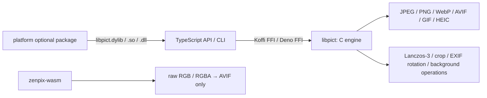

# zenpix

zenpix exposes a native C image-processing engine through a TypeScript API and CLI for Node.js, Bun, and Deno. It decodes JPEG / PNG / WebP / AVIF / GIF / HEIC, applies Lanczos-3 resizing, and encodes WebP / AVIF / PNG.

**[日本語README](./README.md)**

**npm:** [zenpix](https://www.npmjs.com/package/zenpix) (Node.js / Bun / Deno, native) · [zenpix-wasm](https://www.npmjs.com/package/zenpix-wasm) (browser-side AVIF encoder)

## What it provides

- A C implementation of the decode → crop → resize → encode pipeline
- TypeScript APIs using Koffi FFI for Node.js / Bun and native FFI for Deno
- A CLI with batch and stdin/stdout support
- Prebuilt native libraries delivered as five platform-specific optional packages
- A browser WASM package that encodes raw RGB / RGBA pixels to AVIF

`zenpix-wasm` is not a port of the complete native pipeline. It provides **AVIF encoding from raw RGB / RGBA only** and does not include image decoding, resizing, or the CLI.

## Architecture



| Layer | Responsibility |
|---|---|
| C / CMake | Codec bridges, Lanczos-3, crop, rotation, background operations, and shared-library builds |
| TypeScript API | Binary discovery, FFI, validation, native-memory copying and release, and high-level APIs |
| CLI | File I/O, batch conversion, stdin/stdout, and option parsing |
| Optional packages | Deliver a prebuilt `libpict` selected for the current OS and CPU |
| WASM | Encode raw RGB / RGBA pixels to AVIF in the browser |

## Install

### Node.js / Bun

```bash
npm install zenpix
```

zenpix is ESM-only. On supported platforms, the selected optional package contains the native library, so consumers do not need a C build environment.

### Deno

```typescript
import { decode, encodeAvif } from "npm:zenpix/deno";
// deno run requires --allow-ffi and --allow-read for input files
```

Normal use does not require `--allow-env`. Add `--allow-env=ZENPIX_LIB` only when selecting a native library through the `ZENPIX_LIB` override.

### Browser

```bash
npm install zenpix-wasm
```

Check installed versions with:

```bash
npx zenpix --version
npm list zenpix
npm list zenpix-wasm
```

## Quick start

```typescript
import { decode, resize, encodeAvif, convert } from "zenpix";
import { readFileSync, writeFileSync } from "node:fs";

const image = decode(readFileSync("photo.jpg"));
const resized = resize(image, {
  width: 1920,
  height: 1080,
  fit: "cover",
});
const avif = encodeAvif(resized, { quality: 60, threads: 4 });
if (avif) writeFileSync("output.avif", avif);

const result = convert(readFileSync("photo.jpg"), {
  resize: { width: 1920, height: 1080, fit: "cover" },
  encode: { format: "avif", quality: 60 },
});
if (result) writeFileSync("output.avif", result);
```

Run the CLI through `npx`:

```bash
npx zenpix photo.jpg
npx zenpix *.jpg --out-dir ./avif/ --threads 4
npx zenpix icon.jpg favicon.png --remove-bg --round-corners full
```

## Formats and limitations

| Format | Decode | Encode | Limitations and notes |
|---|:---:|:---:|---|
| JPEG | ✅ | — | Applies EXIF Orientation and extracts embedded ICC profiles |
| PNG | ✅ | ✅ | Supports ICC extraction and passthrough |
| WebP | ✅ | ✅ | Animated WebP is unsupported; lossy and lossless encoding |
| AVIF | ✅ | ✅ | Requests YUV 4:4:4 and lossless-alpha settings from libavif |
| GIF | ✅ | — | First frame only; output is RGB, so GIF transparency is not preserved |
| HEIC / HEIF | ✅ | — | macOS / Linux only; requires the system `libheif`; unsupported on Windows |

Additional APIs include `crop`, `removeBackground`, `flattenBackground`, and `roundCorners`.

## Quality and performance

The AVIF encoder requests **YUV 4:4:4** from libavif and sets its alpha-quality option to lossless. These settings are intended to preserve saturated colours and fine colour boundaries, but actual output also depends on codec implementation and version and can be larger. The same numeric `quality` value does not represent equivalent visual quality across different encoders.

| Sharp (`quality=60`) | zenpix (`quality=60`) |
|:---:|:---:|
|  |  |

On this fixture, Sharp produced 8,960 bytes and zenpix produced 12,351 bytes. The zenpix output was 37.8% larger at the same numeric `quality=60`; more visible detail is therefore not treated as evidence of better compression efficiency. At near-matched sizes, Sharp had about 0.5 dB higher RGB PSNR on this fixture.

Processing time depends on the CPU, thread count, image characteristics, resolution, and dependency versions. Existing measurements contain both cases where zenpix was faster on a low-core VPS for selected illustrations and cases where Sharp was faster on macOS or simple images. Results without redistributable fixtures are not treated as general performance evidence. See the [benchmark notes](./docs/reference/benchmarks.md) for conditions and limitations.

The immediate motivation was a Sharp route on the old 2-vCPU, 2-GB VPS website that generated three outputs in one request, including a full-resolution AVIF without a preceding resize, and did not finish within a practical time. This was a request design that exceeded the environment's latency budget, not evidence of Sharp's general speed, CPU usage, or memory behavior.

The native Lanczos-3 implementation keeps a scalar two-pass separable filter as its reference path. On supported CPUs, RGBA horizontal and vertical passes use arm64 NEON or x86_64 SSE2. One-, two-, and three-channel images and unsupported CPUs fall back to scalar. `ZENPIX_ENABLE_SIMD=OFF` builds the forced-scalar path from the same source. The vertical pass and AVIF encoding accept a per-call thread count.

Native 1.0.4 includes this SIMD path. On all five native targets, GitHub Actions builds the SIMD and forced-scalar variants from the same source and runs C tests, shared-library FFI comparisons, AVIF roundtrip tests, and runtime-dependency checks. Each job packs the binary it just built, verifies its SHA-256 identity, and runs packed Node.js, Bun, Deno, and CLI smoke tests. The aggregate job verifies versions, required files, and licenses across the root, five native optional packages, and WASM tarballs. CI distribution checks, post-publication registry retrieval, and real-machine use are treated as separate evidence.

## Platform support

| Runtime | macOS arm64 | macOS x64 | Linux x64 | Linux arm64 | Windows x64 |
|---|:---:|:---:|:---:|:---:|:---:|
| Node.js 18+ | Target | Target | Target | Target | Target |
| Bun | Target | Target | Target | Target | Target |
| Deno 2.x | Target | Target | Target | Target | Target |

“Target” means that a package and CI workflow exist. Version 1.0.4 targets macOS 12 or later, Linux with glibc 2.34 or later, and Windows x64; Linux CI rejects references to symbols newer than `GLIBC_2.34`. Prebuilt packages are not provided for Alpine Linux (musl) or Windows arm64.

macOS 1.0.4 binaries statically link the codec dependencies and use a macOS 12.0 deployment target. CI checks for the absence of external codec dylib dependencies, `minos 12.0`, and working packed API / CLI conversion.

HEIC / HEIF has an additional runtime dependency:

```bash
# macOS
brew install libheif

# Ubuntu / Debian-based Linux
sudo apt install libheif-dev
```

## Browser-side AVIF encoding

```typescript
import { createAvifEncoder } from "zenpix-wasm/encoder";

const encoder = await createAvifEncoder();
const avif = encoder.encode(pixels, width, height, {
  quality: 60,
  speed: 10,
});
encoder.dispose();
```

`pixels` must be an RGB or RGBA `Uint8Array`. Decode and resize the source separately. See [wasm/README.md](./wasm/README.md) for details.

For compatibility with the published 1.0.0 API, `import createAvifModule from "zenpix-wasm"` continues to return the baseline raw Emscripten factory. Import the high-level wrapper from `zenpix-wasm/encoder`.

## Documentation

- [Getting started / API reference](./docs/reference/index.md)
- [CLI guide](./docs/reference/cli.md)
- [Benchmark notes](./docs/reference/benchmarks.md)
- [Environments and troubleshooting](./docs/reference/environments.md)
- [Browser AVIF encoder](./wasm/README.md)

## License

MIT © 2026 Tsukasa Tsukimura

See [LICENSE](./LICENSE) for zenpix and [THIRD_PARTY_LICENSES](./THIRD_PARTY_LICENSES) for notices covering bundled or linked third-party libraries.

## For contributors

Install the native dependencies, then run:

```bash
cmake -S . -B build -DCMAKE_BUILD_TYPE=Release
cmake --build build --parallel
cmake -S . -B build-scalar -DCMAKE_BUILD_TYPE=Release -DZENPIX_ENABLE_SIMD=OFF
cmake --build build-scalar --parallel
npm run build
bun run test/resize_simd_precision.ts
bun run test/lanczos_precision.ts
bun run test/ops_precision.ts
```

See [docs/reference/environments.md](./docs/reference/environments.md) for platform-specific notes.
