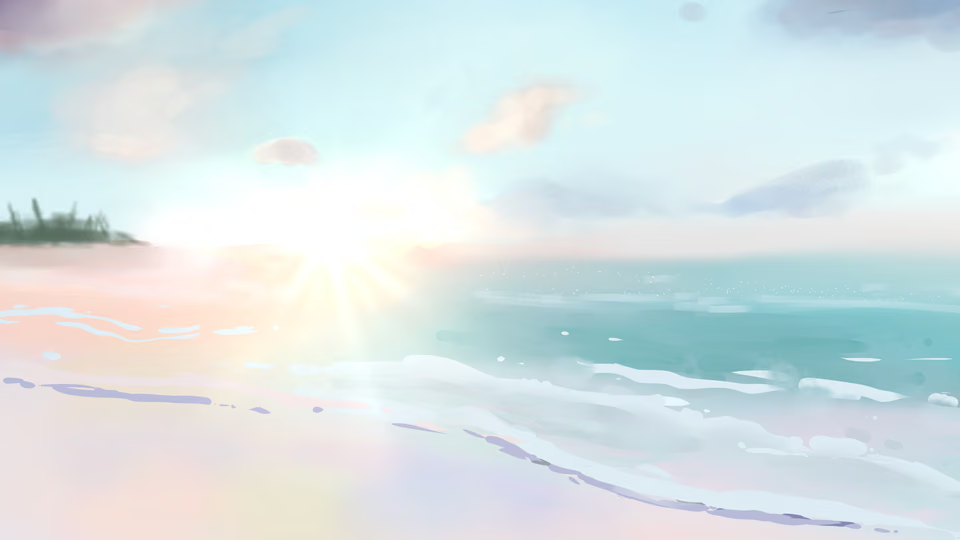

# zenpix

High-performance image processing library built in C. Decodes JPEG / PNG / WebP / AVIF / GIF / HEIC and encodes to WebP / AVIF / PNG with Lanczos-3 resizing. Works with Node.js, Bun, and Deno via FFI — no build tools required.

**[日本語ドキュメント](./README.ja.md)**

**npm:** [zenpix](https://www.npmjs.com/package/zenpix) (Node / Bun / Deno, native)

---

## Install

```bash
npm install zenpix
```

> ESM only. Add `"type": "module"` to your `package.json`. CommonJS (`require`) is not supported.

**Deno:**

```typescript
import { decode, encodeAvif } from "npm:zenpix/deno";
// requires --allow-ffi flag
```

---

## Quick Start

```typescript
import { decode, resize, encodeAvif, convert } from "zenpix";
import { readFileSync, writeFileSync } from "fs";

// decode → resize → AVIF
const image   = decode(readFileSync("photo.jpg"));
const resized = resize(image, { width: 1920, height: 1080, fit: "cover" });
const avif    = encodeAvif(resized, { quality: 60, threads: 4 });
if (avif) writeFileSync("output.avif", avif);

// one-liner pipeline
const result = convert(readFileSync("photo.jpg"), {
  resize: { width: 1920, height: 1080, fit: "cover" },
  encode: { format: "avif", quality: 60 },
});
if (result) writeFileSync("output.avif", result);
```

**CLI** — no install needed:

```bash
npx zenpix photo.jpg                          # → photo.avif
npx zenpix *.jpg --out-dir ./avif/ --threads 4
npx zenpix icon.jpg favicon.png --remove-bg --round-corners full
```

---

## Why zenpix?

### Better quality — always

zenpix encodes AVIF using **YUV 4:4:4** (full chroma, no subsampling). Sharp defaults to YUV 4:2:0, which discards 75% of chroma information. For illustration and character art with saturated colours and fine gradients, the difference is visible at the same `quality` setting. Alpha channels are always encoded losslessly.

| Sharp (quality=60) | zenpix (quality=60) |
|:---:|:---:|
|  |  |

*Pastel beach illustration. Sharp produces a smaller file by discarding subtle tonal nuances; zenpix retains them at a slightly larger size.*

### Faster on VPS — for illustration content

On low-core VPS environments (2–4 vCPUs), zenpix outperforms Sharp on complex illustration and character content by **1.3–1.6×** in wall-clock time.

| Fixture | FHD ratio | WQHD ratio | 4K ratio |
|---|:---:|:---:|:---:|
| Character illustration | **1.43×** | **1.35×** | **1.29×** |
| Oil-paint landscape | **1.62×** | **1.45×** | **1.63×** |

*ratio = Sharp ÷ zenpix median (>1 means zenpix is faster). VPS: Ubuntu, 2 vCPU. Pipeline: PNG → resize → AVIF (quality=60, speed=6). [Full benchmark →](./docs/reference/benchmarks.md)*

---

## Features

- **Decode**: JPEG / PNG / WebP / AVIF / GIF (first frame) / HEIC·HEIF (macOS & Linux)
- **Resize**: Lanczos-3, SIMD optimized (NEON/SSE2), fit modes (stretch / contain / cover)
- **Encode**: WebP / AVIF (per-call `threads` option) / PNG
- **Pipeline**: `convert()` — decode → crop → resize → encode in one call
- **CLI**: `npx zenpix` with batch, stdin/stdout support
- **Background removal**: `removeBackground` / `roundCorners` / `flattenBackground`

---

## Platform Support

| Runtime | macOS arm64 | macOS x64 | Linux x64 | Linux arm64 | Windows x64 |
|---|:---:|:---:|:---:|:---:|:---:|
| Node.js 18+ | ✅ | ✅ | ✅ | ✅ | ✅ |
| Bun | ✅ | ✅ | ✅ | ✅ | ✅ |
| Deno 2.x | ✅ | ✅ | ✅ | ✅ | ✅ |

---

## Documentation

- [Getting Started / API Reference](./docs/reference/index.md)
- [CLI Guide](./docs/reference/cli.md)
- [Benchmarks](./docs/reference/benchmarks.md)
- [Environments & Troubleshooting](./docs/reference/environments.md)

---

## License

MIT © 2026 Tsukasa Tsukimura

Uses: libjpeg-turbo, zlib, libpng, libwebp, libavif, libaom, libheif — see [THIRD_PARTY_LICENSES](./THIRD_PARTY_LICENSES).

---

## For Contributors

```bash
cmake -S . -B build -DCMAKE_BUILD_TYPE=Release
cmake --build build --parallel
npm run build   # TypeScript → js/dist/
```

See [docs/reference/environments.md](./docs/reference/environments.md) for local build details.
