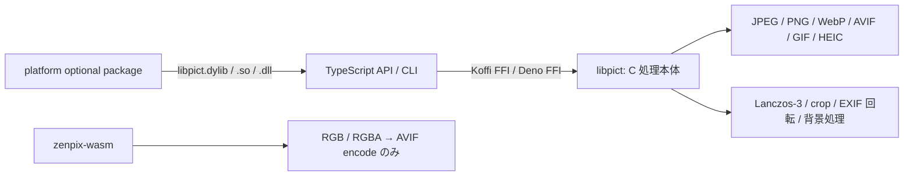

# zenpix

Node.js / Bun / Deno から、C ネイティブの画像処理エンジンを TypeScript API または CLI 経由で利用するためのライブラリです。JPEG / PNG / WebP / AVIF / GIF / HEIC をデコードし、Lanczos-3 リサイズを経て WebP / AVIF / PNG にエンコードします。

**[English README](./README.en.md)**

**npm:** [zenpix](https://www.npmjs.com/package/zenpix)（Node.js / Bun / Deno・ネイティブ）・[zenpix-wasm](https://www.npmjs.com/package/zenpix-wasm)（ブラウザ向け AVIF エンコーダ）

## 何を提供するか

- C で実装した decode → crop → resize → encode パイプライン
- Node.js / Bun 向け Koffi FFI と Deno FFI の TypeScript API
- バッチ・stdin/stdout に対応する CLI
- 5 種類の対応 OS / CPU 向けビルド済み optional package
- RGB / RGBA 生ピクセルから AVIF を生成するブラウザ向け WASM package

`zenpix-wasm` はネイティブ版の全機能移植ではありません。**画像の decode、resize、CLI は含まず、RGB / RGBA からの AVIF encode のみ**を提供します。

## 構成



| 層 | 役割 |
|---|---|
| C / CMake | コーデック接続、Lanczos-3、crop、回転、背景処理と共有ライブラリのビルド |
| TypeScript API | バイナリ探索、FFI、入力検証、ネイティブメモリのコピーと解放、高水準 API |
| CLI | ファイル入出力、バッチ変換、stdin/stdout、オプション解析 |
| optional package | OS / CPU ごとのビルド済み `libpict` を npm install 時に選択 |
| WASM | ブラウザ内で RGB / RGBA 生ピクセルを AVIF にエンコード |

## インストール

### Node.js / Bun

```bash
npm install zenpix
```

ESM 専用です。対応する optional package が配布されている環境では、利用者による C ビルドは不要です。

### Deno

```typescript
import { decode, encodeAvif } from "npm:zenpix/deno";
// deno run では --allow-ffi と入力ファイル用の --allow-read が必要
```

通常利用では`--allow-env`は不要です。`ZENPIX_LIB`でネイティブライブラリを上書きする場合だけ、`--allow-env=ZENPIX_LIB`を追加してください。

### ブラウザ

```bash
npm install zenpix-wasm
```

インストール済みversionは次のコマンドで確認できます。

```bash
npx zenpix --version
npm list zenpix
npm list zenpix-wasm
```

## クイックスタート

```typescript
import { decode, resize, encodeAvif, convert } from "zenpix";
import { readFileSync, writeFileSync } from "node:fs";

const image = decode(readFileSync("photo.jpg"));
const resized = resize(image, {
  width: 1920,
  height: 1080,
  fit: "cover",
});
const avif = encodeAvif(resized, { quality: 60, threads: 4 });
if (avif) writeFileSync("output.avif", avif);

const result = convert(readFileSync("photo.jpg"), {
  resize: { width: 1920, height: 1080, fit: "cover" },
  encode: { format: "avif", quality: 60 },
});
if (result) writeFileSync("output.avif", result);
```

CLI は `npx` から実行できます。

```bash
npx zenpix photo.jpg
npx zenpix *.jpg --out-dir ./avif/ --threads 4
npx zenpix icon.jpg favicon.png --remove-bg --round-corners full
```

## 対応形式と制限

| 形式 | decode | encode | 制限・補足 |
|---|:---:|:---:|---|
| JPEG | ✅ | — | EXIF Orientation を自動適用。埋め込み ICC を取得 |
| PNG | ✅ | ✅ | ICC の取得・再付与に対応 |
| WebP | ✅ | ✅ | animated WebP は非対応。lossy / lossless encode |
| AVIF | ✅ | ✅ | encode時にlibavifへYUV 4:4:4とlossless alpha設定を要求 |
| GIF | ✅ | — | 先頭フレームのみ。RGB 出力のため GIF の透過情報は保持しない |
| HEIC / HEIF | ✅ | — | macOS / Linux のみ。システムの `libheif` が必要。Windows は非対応 |

追加 API として `crop`、`removeBackground`、`flattenBackground`、`roundCorners` を提供します。

## 画質と性能の考え方

AVIF encode実装はlibavifへ **YUV 4:4:4** を指定し、alpha qualityをlosslessに設定します。これは彩度の高い色や細い色境界を保持する意図の設定ですが、実際の出力は依存するcodec実装・versionにも左右され、ファイルサイズが大きくなる場合があります。また、異なるエンコーダの同じ`quality`値は同じ画質を意味しません。

| Sharp (`quality=60`) | zenpix (`quality=60`) |
|:---:|:---:|
|  |  |

このfixtureではSharpが8,960 bytes、zenpixが12,351 bytesでした。同じ`quality=60`でもzenpixの方が37.8%大きいため、細部の見え方を圧縮効率の優位性とは扱いません。ファイルサイズを近づけた客観比較では、このfixtureのRGB PSNRはSharpが約0.5 dB高い結果でした。

処理時間は CPU、スレッド数、画像の特徴、解像度、依存ライブラリによって変わります。既存測定では、少コア VPS の一部イラストで zenpix が Sharp より速い結果と、Mac や単純構造の画像で Sharp が速い結果の両方があります。再配布可能な fixture がない測定値は一般性能の根拠には使用しません。条件と既知の制約は[ベンチマーク詳細](./docs/reference/benchmarks.md)を参照してください。

開発の直接的な動機は、2 vCPU・2 GB VPS上の旧サイトで、事前縮小しないフル解像度AVIFを含む3成果物を1 requestで生成するSharp経路が実用時間内に完了しなかったことです。当時のrequest設計が環境の処理時間予算に合わなかった事例であり、Sharp一般の速度・CPU・memory特性を示すものではありません。

ネイティブの Lanczos-3 はscalarの2-pass separable filterを正解基準とし、対応CPUではRGBAの水平・垂直passにarm64 NEONまたはx86_64 SSE2を使用します。1 / 2 / 3 channelと未対応CPUはscalarへfallbackします。`ZENPIX_ENABLE_SIMD=OFF`で同じsourceから強制scalar版をbuildできます。垂直passとAVIF encodeは呼び出しごとにスレッド数を指定できます。

このSIMD経路はnative 1.0.3として公開済みです。GitHub Actionsの5 native環境ではSIMD版と強制scalar版を同じsourceからbuildし、C test、共有ライブラリFFI比較、AVIF roundtrip、runtime依存検査を実行しました。各jobは直前にbuildしたbinaryをpackし、SHA256一致とNode.js / Bun / Deno API、CLI実変換を確認しています。集約jobでroot、5 native optional packages、WASMの計7 tarballについてversion・必須ファイル・licenseを検査し、同じtarballをnpmへ公開しました。全packageのregistry metadataとintegrity、macOS arm64でのregistry再installとCLI実変換を確認済みです。他の4 native環境での公開後実機利用は未確認です。

## 動作環境

| ランタイム | macOS arm64 | macOS x64 | Linux x64 | Linux arm64 | Windows x64 |
|---|:---:|:---:|:---:|:---:|:---:|
| Node.js 18+ | 対象 | 対象 | 対象 | 対象 | 対象 |
| Bun | 対象 | 対象 | 対象 | 対象 | 対象 |
| Deno 2.x | 対象 | 対象 | 対象 | 対象 | 対象 |

表の「対象」は公開packageとCI workflowの対象を示します。1.0.3はmacOS 12以上、glibc 2.34以上のLinux、Windows x64を対象とし、Linux CIは`GLIBC_2.34`より新しいsymbol参照を拒否します。Alpine Linux（musl）とWindows arm64のビルド済みpackageは提供していません。

macOS版1.0.3はcodecを静的リンクし、macOS 12.0をdeployment targetとしてbuild・検査しています。npm registryから再取得したmacOS arm64 packageで外部codec dylib依存がないこと、`minos 12.0`、API / CLI実変換を確認済みです。

HEIC / HEIFだけは追加の実行時依存があります。

```bash
# macOS
brew install libheif

# Ubuntu / Debian系
sudo apt install libheif-dev
```

## ブラウザ向け AVIF encode

```typescript
import { createAvifEncoder } from "zenpix-wasm/encoder";

const encoder = await createAvifEncoder();
const avif = encoder.encode(pixels, width, height, {
  quality: 60,
  speed: 10,
});
encoder.dispose();
```

`pixels`はRGBまたはRGBAの`Uint8Array`です。ファイル形式のdecodeやresizeは呼び出し側で行ってください。詳しくは[wasm/README.md](./wasm/README.md)を参照してください。

公開済み1.0.0との互換性のため、`import createAvifModule from "zenpix-wasm"`はbaseline版のraw Emscripten factoryを引き続き返します。高水準wrapperは`zenpix-wasm/encoder`からimportします。

## ドキュメント

- [はじめに / APIリファレンス](./docs/reference/index.md)
- [CLIガイド](./docs/reference/cli.md)
- [ベンチマーク詳細](./docs/reference/benchmarks.md)
- [動作環境・トラブルシューティング](./docs/reference/environments.md)
- [ブラウザ向けAVIFエンコーダ](./wasm/README.md)

## ライセンス

MIT © 2026 月村つかさ

既存のライセンス本文は[LICENSE](./LICENSE)、同梱・リンクする第三者ライブラリのnoticeは[THIRD_PARTY_LICENSES](./THIRD_PARTY_LICENSES)を参照してください。

## 開発者向け

依存ライブラリを導入した上で実行します。

```bash
cmake -S . -B build -DCMAKE_BUILD_TYPE=Release
cmake --build build --parallel
cmake -S . -B build-scalar -DCMAKE_BUILD_TYPE=Release -DZENPIX_ENABLE_SIMD=OFF
cmake --build build-scalar --parallel
npm run build
bun run test/resize_simd_precision.ts
bun run test/lanczos_precision.ts
bun run test/ops_precision.ts
```

環境別の注意は[docs/reference/environments.md](./docs/reference/environments.md)を参照してください。
